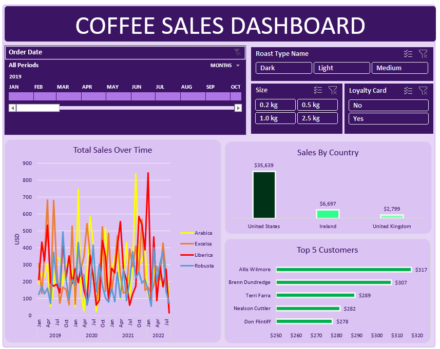

# Coffee Sales Analysis Dashboard | Microsoft Excel

> **Portfolio Stage 2 — Technical Development | Multi-table Analysis | Excel Functions | Dashboarding**

This project represents the next stage in my data analytics development. After building my first healthcare dashboard, I wanted to strengthen the technical side of my Excel work by combining data from multiple tables, using lookup functions, and analysing commercial sales performance.

## Project Overview

The analysis brings together order, customer and product data to explore sales performance, customer value, product demand and geographic trends.

The project contains approximately **1,000 order records** across three source tables:

- **Orders** — transaction-level order information
- **Customers** — customer details, location and loyalty status
- **Products** — coffee type, roast type, size, pricing and product information

## Business Questions

- How have coffee sales changed over time?
- Which coffee types generate the most sales?
- Which countries contribute the most revenue?
- Who are the highest-value customers?
- How do roast type, coffee size and loyalty status affect performance?
- How can these findings be presented in an interactive dashboard?

## Headline Findings

- Total analysed sales were approximately **£45.1K**.
- The **United States** generated the largest share of sales in the dataset.
- Customer-level aggregation made it possible to identify the highest-value customers.
- Monthly and yearly analysis highlighted changes in demand across Arabica, Excelsa, Liberica and Robusta.

## Data Preparation

A major focus of this project was combining information stored across separate tables.

I used:

- `XLOOKUP`
- `INDEX`
- `MATCH`
- `IF`

These functions were used to retrieve customer and product attributes and build a consolidated **Clean orders** table for analysis.

The prepared table includes fields such as:

- Order ID and Order Date
- Customer and Product IDs
- Quantity
- Customer Name and Country
- Coffee Type and Roast Type
- Size and Unit Price
- Sales

## Analysis & Dashboard

PivotTables and PivotCharts were used to analyse:

- sales over time
- sales by country
- coffee-type performance
- top customers

The final dashboard brings these views together and allows the data to be explored using interactive filters and slicers.

## Skills Demonstrated

- Microsoft Excel
- Multi-table data preparation
- XLOOKUP
- INDEX and MATCH
- IF statements
- Excel Tables
- PivotTables
- PivotCharts
- Sorting and filtering
- Slicers
- Customer analysis
- Product analysis
- Sales analysis
- Dashboard design
- Business data visualisation

## Workbook Structure

| Worksheet | Purpose |
|---|---|
| orders | Original order-level data |
| customers | Customer reference data |
| products | Product and pricing information |
| Clean orders | Prepared analytical dataset |
| Documentation | Project documentation |
| Total Sales | Sales trend PivotTable |
| Country Bar Chart | Country-level analysis |
| Top 5 Customers | Highest-value customer analysis |
| Dashboard | Final interactive dashboard |

## Portfolio Journey

**[Stage 1 — Healthcare Patient Risk Analysis](https://github.com/RxAnalyst-Aisosa/Healthcare-Patient-Risk-Analysis-Dashboard)**  
→ **Stage 2 — Technical Development:** this project  
→ **[Stage 3 — Excel Sales Analysis Dashboard](https://github.com/RxAnalyst-Aisosa/Excel-Sales-Analysis-Dashboard)**

## Portfolio Progression

Compared with my first healthcare dashboard, this project required more structured data preparation and stronger use of Excel formulas across multiple source tables.

It reflects an important step in my development from basic dashboard creation toward a more complete analytical workflow involving data integration, business questions and customer/product-level analysis.

My next project builds further on this by placing greater emphasis on KPI design, executive-style reporting and professional project documentation.

---

**Aisosa Elizabeth Erhunmwunsee**  
*Pharmacy | Business Analytics | Data Analysis | Business Intelligence*
